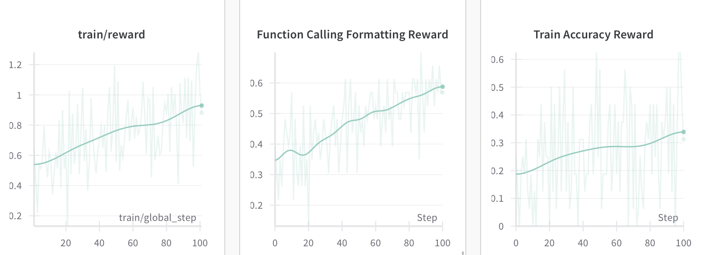

# **AutoDidact: Bootstrapping Search Through Self-Verification**

**Research exploring how small LLMs can autonomously enhance their own research and reasoning capabilities by generating, researching, and answering self-created question-answer pairs, learning agentic search via reinforcement learning. All running on a single RTX 4090!**

**Credits:** This project was built using [Unsloth's Efficient GRPO code](https://unsloth.ai/blog/r1-reasoning), and adds support for function calling and agentic loops.

---

## 🚀 **Key Features**

- **Self-Bootstrapping with Llama-8B:** Llama-8B autonomously generates meaningful question-answer pairs from documents, then trains itself to search the corpus effectively to answer these self-generated questions.
- **Autonomous Self-Verification:** Llama-8B evaluates the accuracy of its own answers, creating a self-improving feedback loop.
- **GRPO Reinforcement Learning:** Implements Group Relative Policy Optimization (GRPO) to refine Llama-8B’s ability to research, search, and reason effectively.
- **Fully Autonomous Open-Source Pipeline:**
  Every step, including question generation, answer research, verification, embedding creation, and reinforcement learning, runs locally using open-source models.

---
## 📊 **Demonstrated Results**



After just **100 steps of GRPO training** (1 hour on a single RTX 4090 GPU), Llama-8B significantly improved its ability to research and answer questions from the Apollo 13 mission report.

On a validation set of 68 questions, **accuracy more than doubled from 23% to 59%**.

---

## 🔍 **Example: Adaptive Search Trajectory**

At the start of training, the model frequently **misused the search tool**, often:

- Formatting tool calls incorrectly.
- Hallucinating responses instead of actually querying the corpus.
- Generating entire sequences where it **role-played both** the search engine and itself, responding to imaginary search results.

Through training, however, the model **learned to reason and search effectively**. It began issuing **well-formed queries**, refining its searches based on partial results, and successfully retrieving accurate answers.

The following example demonstrates this learned adaptive search behavior **after training**.

### **Example Question**

**What was the reason for substituting the backup Command Module Pilot 3 days prior to the Apollo 13 flight?**

### **Step-by-Step Search Process**

1. **Query** : `"Apollo 13 Command Module Pilot substitution"`

   - **Outcome**: Retrieved operational support details, but no explanation for the substitution.
   - **Agent's Action**: Recognized missing information → **Refined query**.
2. **Query** : `"Apollo 13 Command Module Pilot substitution reason"`

   - **Outcome**: Retrieved general mission anomaly details, but still no direct answer.
   - **Agent's Action**: Increased query specificity.
3. **Query** : `"Apollo 13 John 'Jack' Swigert substitution"`

   - **Outcome**: Found general mission reports, but still lacked a clear reason for substitution.
   - **Agent's Action**: Hypothesized illness might be a factor → **Refined query accordingly**.
4. **Query** : `"Apollo 13 Jack Swigert illness substitution"`

   - **Outcome**: Retrieved the **exact explanation**:
     *"Several days prior to launch, the backup Lunar Module Pilot became sick with measles. Examinations of the prime crew indicated that the Command Module Pilot was not immune to the disease; therefore, the backup Command Module Pilot was substituted."*

### **Final Answer**

The original Command Module Pilot lacked immunity to measles, necessitating his replacement by Jack Swigert.

This example shows how llama learns to do multiple searches to find answers to its questions.

---

## 📈 **Quickstart**

### **Installation**

```bash
pip install -r requirements.txt
```

### **Data Generation & Training**

Begin by generating the embeddings, questions, and answers:

```bash
python generate_data.py  # Generate QA pairs and embeddings for your documents
```

Now, run `autodidact.ipynb` and watch your research agent learn!

---

## 🛠️ **Code Structure**

- **`generate_data.py`** – Automates QA pair generation and indexing.
- **`search_module.py`** – Enables semantic search over document corpus.
- **`embeddings.py`** – Manages document/query embedding generation.
- **`rl_helpers.py`** – Controls agent interactions and reward logic.
- **`autodidact.ipynb`** – Full training pipeline example.

---

## 🔬 **Customizing the Dataset**

Replace the existing Apollo 13 mission report (`data/mission_report.md`) with your own markdown file. Then, rerun:

```bash
python generate_data.py
```

This will generate new question-answer pairs and build a search index, allowing you to train a research agent on **any dataset**.

---
