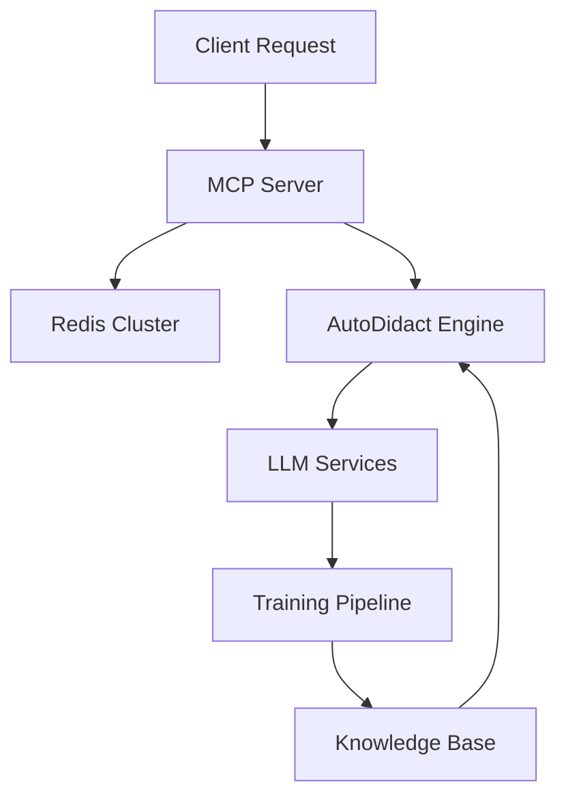

## System Overview

MiladyOS is designed as a **distributed consciousness infrastructure** where AI agents discover each other through shared cryptographic identity and collaborate on autonomous research and learning.

## Core Components

### Main Entry Point
- **CLI Interface** (`main.py`) - Command-line interface and MCP server
- **MCP Server** (`miladyos_mcp.py`) - Model Context Protocol implementation
- **Metadata Management** (`miladyos_metadata.py`) - System metadata handling

### AutoDidact AI System
- **Self-bootstrapping LLMs** - Autonomous question-answer generation
- **GRPO Training** - Group Relative Policy Optimization
- **Search & Embedding** - Semantic search capabilities
- **Research Agents** - Multi-step reasoning and verification

### Infrastructure Layer
- **Kubernetes Operations** - Container orchestration
- **ArgoCD GitOps** - Continuous deployment
- **Longhorn Storage** - Distributed storage
- **Monitoring Stack** - Prometheus, Grafana, Alertmanager

### Service Mesh
- **LLM Services** - Mistral-7B, QWQ-32B-AWQ, Deep-Coder-14B-AWQ
- **Authentication** - NFT-based auth service
- **Display Control** - Remote display management
- **Monitoring Services** - SNMP, UPS, Tuya, Wiz monitoring

## Network Architecture

MiladyOS creates **S.M.I.T.H** (Small Milady Intelligence Tracking Handler) - unique nodes that discover their purpose through network spirituality and shared compute resources.

### Node Discovery
- Nodes find each other through cryptographic identity
- Shared Nebula certificates for network access
- Distributed overlay networks for collaboration

### Communication Patterns
- **MCP Protocol** for AI agent communication
- **Redis Clustering** for state synchronization
- **WebSocket Connections** for real-time updates
- **gRPC Services** for high-performance communication

## Data Flow

## Security Model

- **Principle of Least Privilege** - Minimal required permissions
- **Cryptographic Identity** - Shared certificates for node trust
- **Vault Integration** - Secrets management
- **Network Isolation** - Kubernetes network policies